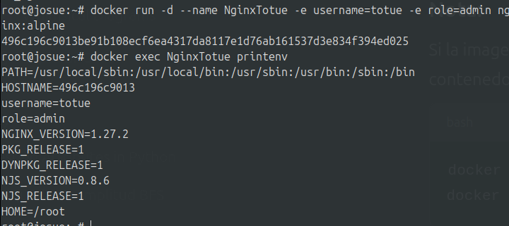
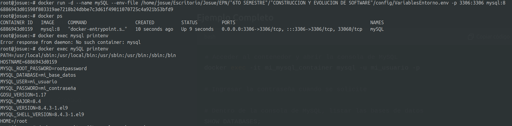

# Variables de Entorno

### ¿Qué son las variables de entorno

Las variables de entorno son configuraciones globales que afectan cómo funcionan los procesos y programas en el sistema.
```
Ejemplo
HOME=/home/usuario
```
### Para crear un contenedor con variables de entorno?

```
docker run -d --name <nombre contenedor> -e <nombre variable1>=<valor1> -e <nombre variable2>=<valor2>
```

### Crear un contenedor a partir de la imagen de nginx:alpine con las siguientes variables de entorno: username y role. Para la variable de entorno rol asignar el valor admin.
```
 docker run -d --name NginxTotue -e username=totue -e role=admin nginx:alpine
```
## Captura de pantalla



### Crear un contenedor con mysql:8 , mapear todos los puertos

```
root@josue:~# docker run -d --name mi_mysql -e MYSQL_ROOT_PASSWORD=1234 -P mysql:8
```

### ¿El contenedor se está ejecutando?
Si se esta ejecutando porque lo cree con contraseña entonces si se crea y ejecuta sin problema

### Identificar el problema
El problema era lo que se crea sin poner una contraseña

### Eliminar el contenedor creado con mysql:8 
```
docker stop mi_mysql
docker rm mi_mysql
```
### Para crear un contenedor con variables de entorno especificadas
- Portabilidad: Las aplicaciones se vuelven más portátiles y pueden ser desplegadas en diferentes entornos (desarrollo, pruebas, producción) simplemente cambiando el archivo de variables de entorno.
- Centralización: Todas las configuraciones importantes se centralizan en un solo lugar, lo que facilita la gestión y auditoría de las configuraciones.
- Consistencia: Asegura que todos los miembros del equipo de desarrollo o los entornos de despliegue utilicen las mismas configuraciones.
- Evitar Exposición en el Código: Mantener variables sensibles como contraseñas, claves API, y tokens fuera del código fuente reduce el riesgo de exposición accidental a través del control de versiones.
- Control de Acceso: Los archivos de variables de entorno pueden ser gestionados con permisos específicos, limitando quién puede ver o modificar la configuración sensible.

Previo a esto es necesario crear el archivo y colocar las variables en un archivo, **.env** se ha convertido en una convención estándar, pero también es posible usar cualquier extensión como **.txt**.
```
docker run -d --name <nombre contenedor> --env-file=<nombreArchivo>.<extensión> <nombre imagen>
```
**Considerar**
Es necesario especificar la ruta absoluta del archivo si este se encuentra en una ubicación diferente a la que estás ejecutando el comando docker run.

### Crear un contenedor con mysql:8 , mapear todos los puertos y configurar las variables de entorno mediante un archivo
```
root@josue:~# docker run -d --name mySQL --env-file /home/josue/Escritorio/Josue/EPN/"6TO SEMESTRE"/"CONSTRUCCION Y EVOLUCION DE SOFTWARE"/config/VariablesEntorno.env -p 3306:3306 mysql:8
```

### CAPTURA CON LA COMPROBACIÓN DE LA CREACIÓN DE LAS VARIABLES DE ENTORNO DEL CONTENEDOR ANTERIOR 


### ¿Qué bases de datos existen en el contenedor creado?

**information_schema**

Una base de datos del sistema de MySQL que contiene metadatos sobre las bases de datos, como las estructuras de las tablas y los permisos de usuario.

**mi_base_datos**

 La base de datos personalizada que creaste y configuraste en el archivo mysql.env.

**performance_schema**

 Otra base de datos del sistema utilizada para supervisar el rendimiento del servidor MySQL.
