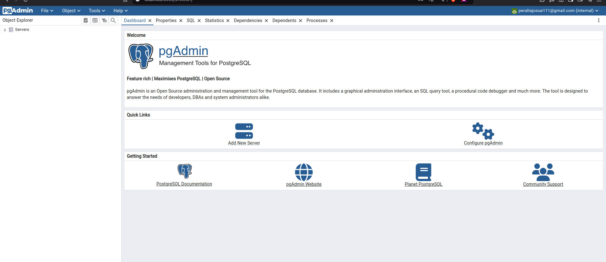
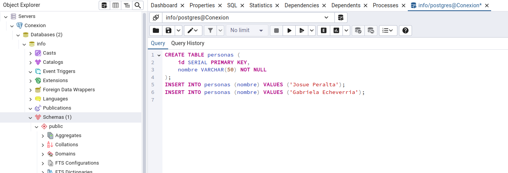
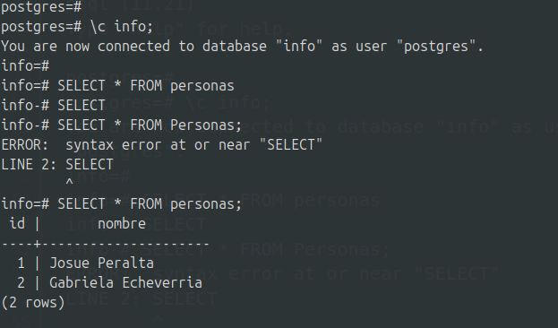

### Crear contenedor de Postgres sin que exponga los puertos. Usar la imagen: postgres:11.21-alpine3.17

```
root@josue:~# docker run -d --name ppstgre -e POSTGRES_PASSWORD=123 postgres:11.21-alpine3.17
```

### Crear un cliente de postgres. Usar la imagen: dpage/pgadmin4
```
docker run -d --name mi_pgadmin -p 8080:80 \
  -e PGADMIN_DEFAULT_EMAIL=admin@admin.com \
  -e PGADMIN_DEFAULT_PASSWORD=admin \
  dpage/pgadmin4
```     
La figura presenta el esquema creado en donde los puertos son:      
**- a: 8080**   
**- b: 80**     
**- c: 5432**


## Desde el cliente
### Acceder desde el cliente al servidor postgres creado.
Con la contraseña y correo que le pasamos arriba en las Variables de Entorno


#### Crear la base de datos info, y dentro de esa base la tabla personas, con id (serial) y nombre (varchar), agregar un par de registros en la tabla, obligatorio incluir su nombre.




Para hacer la conexion toca crear una red de contenedores para que se uedan comunicar porque, ppostgre no esta con los **puertos expuestos**.
Esta red aisla a estos contenedores pero pueden hablar entre ellos por su nombre del conteneor sin importar los puertos 

# Desde el servidor postgresl
### Acceder al servidor
### Conectarse a la base de datos info
### Realizar un select *from personas
```
root@josue:~# docker exec -it ppstgre bash
015e43a4236a:/# psql -U postgres
psql (11.21)
Type "help" for help.

postgres=# 
postgres=# \c info;
You are now connected to database "info" as user "postgres".
info=# 
info=# SELECT * FROM personas
info-# SELECT 
info-# SELECT * FROM Personas;
ERROR:  syntax error at or near "SELECT"
LINE 2: SELECT 
        ^
info=# SELECT * FROM personas;
```
### Captura

