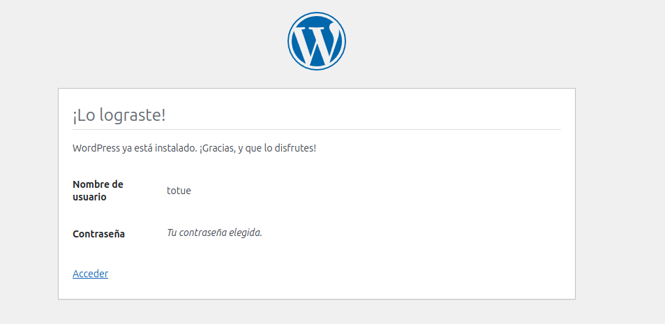
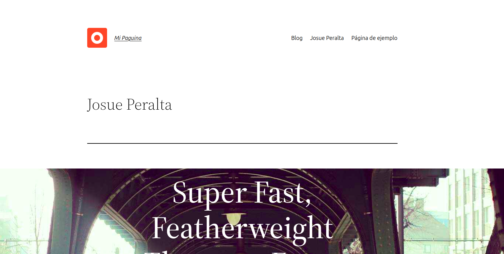

## Esquema para el ejercicio


### Crear la red
```
root@josue:~# docker network create net-wp
```
### Crear el contenedor mysql a partir de la imagen mysql:8, configurar las variables de entorno necesarias
```
root@josue:~# docker run -d \
  --name mysql_container \
  --network net-wp \
  -e MYSQL_ROOT_PASSWORD=1234 \
  -e MYSQL_DATABASE=wordpress \
  -e MYSQL_USER=totue \
  -e MYSQL_PASSWORD=123 \
  mysql:8
```

### Crear el contenedor wordpress a partir de la imagen: wordpress, configurar las variables de entorno necesarias
```
root@josue:~# docker run -d \
  --name wordpress_container \
  --network net-wp \
  -e WORDPRESS_DB_HOST=mysql_container:3306 \
  -e WORDPRESS_DB_NAME=wordpress_db \
  -e WORDPRESS_DB_USER=totue \
  -e WORDPRESS_DB_PASSWORD=123 \
  -p 9300:80 \
  wordpress
```

De acuerdo con el trabajo realizado, en la el esquema de ejercicio el puerto a es **9300**

Ingresar desde el navegador al wordpress y finalizar la configuración de instalación.

Desde el panel de admin: cambiar el tema y crear una nueva publicación.
Ingresar a: http://localhost:9300/ 
recordar que a es el puerto que usó para el mapeo con wordpress
### COLOCAR UNA CAPTURA DEL SITO EN DONDE SEA VISIBLE LA PUBLICACIÓN.


### Eliminar el contenedor wordpress
```
root@josue:~# docker rm wordpress_container
```

### Crear nuevamente el contenedor wordpress
Ingresar a: http://localhost:9300/ 

recordar que a es el puerto que usó para el mapeo con wordpress

### ¿Qué ha sucedido, qué puede observar?

Después de eliminar y volver a crear el contenedor de WordPress, se pierde toda la configuración y el contenido creado anteriormente (tema personalizado, publicaciones, etc.). Esto ocurre porque los datos de WordPress no se almacenaron en un volumen persistente. Al acceder a http://localhost:9300/ nuevamente, aparece la pantalla de configuración inicial de WordPress, como si fuera una instalación nueva.

### OJO CON LOS VOLUMENES GUARDADOS

Al eliminar y recrear el contenedor de WordPress, los datos se han mantenido debido a la persistencia de datos en volúmenes de Docker. Esto significa que, aunque el contenedor fue eliminado, el volumen con la configuración y el contenido previos siguió existiendo y se volvió a conectar al nuevo contenedor. Para una instalación limpia, es necesario eliminar también el volumen asociado; de lo contrario, Docker reutilizará los datos antiguos.


